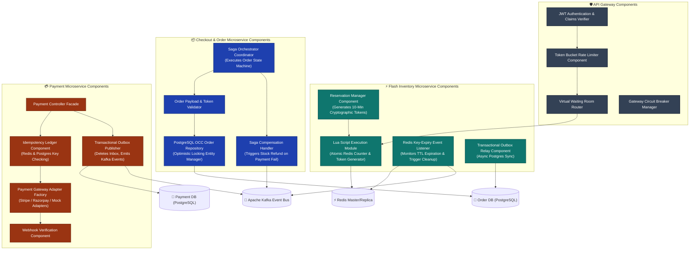

# 02.3 High-Level Design — Component Diagram (C4 Level 3)

## Overview
The Component Diagram illustrates the internal architecture of the core SALESTORM services: **API Gateway**, **Flash Inventory Microservice**, **Checkout & Order Microservice**, and **Payment Microservice**. It exposes internal design components, data flow interfaces, repository abstractions, and resilient event handlers.

---

## Component Architectural Diagram



---

## Detailed Component Specifications

### 1. Flash Inventory Service Components

#### A. Lua Script Execution Module
- **Purpose**: Executes thread-safe single-instance atomic inventory operations directly within the Redis engine memory space.
- **Input**: `product_id`, `user_id`, `reservation_ttl_seconds = 600`.
- **Output**: Success (`reservation_token`, `remaining_units`) or Failure (`SOLD_OUT`, `ALREADY_RESERVED`).
- **Design Pattern**: Command Pattern encapsulated in Redis Lua.

#### B. Redis Key-Expiry Listener & Expiry Monitor
- **Purpose**: Listens to Redis Keyspace Notifications (`__keyevent@0__:expired`).
- **Behavior**: When a reservation key `reservation:prod_101:user_8821` expires, it executes an atomic increment to restore available stock in Redis (`INCR SALES_STOCK_KEY`) and publishes an `inventory.released` event to Kafka.

### 2. Checkout & Order Service Components

#### A. Saga Orchestrator Coordinator
- **Purpose**: Manages the distributed transaction across Inventory, Payment, and Fulfillment services using an explicit State Machine.
- **States**: `CREATED` $\rightarrow$ `RESERVED` $\rightarrow$ `PAYMENT_PENDING` $\rightarrow$ `PAID` $\rightarrow$ `FULFILLED` / `FAILED`.
- **Resilience**: Stores state persistence in PostgreSQL; if node crashes, another instance picks up pending sagas from where they stalled.

#### B. OCC Order Repository
- **Purpose**: Prevents lost updates and phantom writes in PostgreSQL.
- **SQL Pattern**:
  ```sql
  UPDATE inventory_reservations 
  SET status = 'CONFIRMED', version = version + 1 
  WHERE reservation_id = $1 AND version = $2 AND status = 'PENDING';
  ```

### 3. Payment Service Components

#### A. Idempotency Ledger Component
- **Purpose**: Enforces **at-most-once** payment authorization.
- **Operation**: Computes `hash(user_id + reservation_id + idempotency_key)`. Checks Redis first ($< 1\text{ms}$ latency); falls back to PostgreSQL `payment_idempotency` table with a `UNIQUE` constraint.

#### B. Transactional Outbox Publisher
- **Purpose**: Guarantees atomic database updates and event publishing without dual-write inconsistency.
- **Operation**: Writes payment state changes and outbound Kafka events into an `outbox` table within the **same local RDBMS transaction**. A background CDC worker (Debezium / Kafka Connect) tailing the WAL (Write-Ahead Log) streams the events to Kafka.

---
*Document Version: 1.0.0 — SALESTORM 2026 Component Architecture*
