# 02.2 High-Level Design — Container Architecture Diagram (C4 Level 2)

## Overview
The Container Architecture Diagram depicts the runtime microservice containers, data stores, caching layers, and asynchronous event streams that constitute the **SALESTORM 2026** platform. It explicitly delineates synchronous HTTP/gRPC boundaries from asynchronous Kafka event channels.

---

## C4 Container Architecture Diagram

```mermaid
graph TB
    %% Clients
    subgraph Clients ["📱 Client Tier"]
        WebClient["Web Browser App<br/>(React / Next.js)"]
        MobileClient["Mobile App<br/>(Flutter / iOS / Android)"]
    end

    %% Edge & Gateway Tier
    subgraph EdgeTier ["🛡️ Edge & Security Tier"]
        CDN["Cloudflare CDN / WAF<br/>(DDoS Protection & Static Assets)"]
        APIGateway["API Gateway (Kong / Envoy)<br/>- Token Bucket Rate Limiter<br/>- Virtual Waiting Room Queue<br/>- JWT Auth Validator"]
    end

    %% Application Microservices Tier
    subgraph AppTier ["⚙️ Microservices Application Tier"]
        CatalogSvc["Catalog Service<br/>(Go / High Throughput)<br/>Serves Catalog & Stock Status"]
        InventorySvc["Inventory Service<br/>(Go / Lua Executor)<br/>Atomic Reservation Engine"]
        CheckoutSvc["Checkout & Order Service<br/>(Java Spring Boot)<br/>Order State Machine & Saga Coordinator"]
        PaymentSvc["Payment Service<br/>(Node.js / Java)<br/>Payment Gateway Integration & Outbox"]
        FulfillmentSvc["Fulfillment Service<br/>(Python / FastAPI)<br/>WMS & Logistics Orchestrator"]
        NotificationSvc["Notification Worker<br/>(Go / Async Consumer)<br/>SMS / Email Dispatcher"]
    end

    %% Data & Caching Tier
    subgraph DataTier ["💾 Data & Storage Tier"]
        RedisCluster[("⚡ Redis Cluster (Primary & Replica)<br/>- Flash Sale Counter (100 units)<br/>- Reservation Hash Keys (10-min TTL)<br/>- Lua Script Engine")]
        CatalogDB[("📦 Catalog DB (MongoDB / Read Replica)<br/>Product Meta & Static Details")]
        OrderDB[("🐘 Order DB (PostgreSQL Multi-AZ)<br/>- Orders & Line Items (OCC Versioned)<br/>- Inventory Reservation Tables")]
        PaymentDB[("🐘 Payment DB (PostgreSQL Multi-AZ)<br/>- Payment Logs & Inbox/Outbox<br/>- Idempotency Ledger")]
    end

    %% Event Bus & Messaging
    subgraph EventTier ["📡 Message & Event Streaming Tier"]
        KafkaBus["🔥 Apache Kafka Event Stream<br/>Topics:<br/>- inventory.reserved<br/>- inventory.released<br/>- payment.authorized<br/>- payment.failed<br/>- order.created<br/>- order.fulfilled"]
    end

    %% External Systems
    ExtPG["💳 External Payment Gateway"]
    ExtLogistics["🚚 Warehouse WMS / Logistics API"]

    %% Relationships & Flow
    Clients --> CDN
    CDN --> APIGateway
    
    %% API Gateway Routing (Sync)
    APIGateway -- "GET /api/v1/products" --> CatalogSvc
    APIGateway -- "POST /api/v1/reservations" --> InventorySvc
    APIGateway -- "POST /api/v1/orders/checkout" --> CheckoutSvc
    APIGateway -- "POST /api/v1/payments" --> PaymentSvc

    %% Service to Storage (Sync)
    CatalogSvc -- "Cache Read ($< 2ms)" --> RedisCluster
    CatalogSvc -. "DB Fallback Read" .-> CatalogDB

    InventorySvc -- "EXECUTE Lua Atomic Decrement & TTL ($< 5ms)" --> RedisCluster
    InventorySvc -- "Sync Async Outbox Record" --> OrderDB

    CheckoutSvc -- "Validate Reservation & Write Order (OCC)" --> OrderDB
    PaymentSvc -- "Check & Write Idempotency Ledger" --> PaymentDB
    PaymentSvc -- "Process Charge (Sync REST)" --> ExtPG

    %% Event Bus Integrations (Async)
    InventorySvc -. "Publish: inventory.reserved" .-> KafkaBus
    PaymentSvc -. "Publish: payment.authorized / failed" .-> KafkaBus
    CheckoutSvc -. "Consume: payment.* & Publish: order.*" .-> KafkaBus
    FulfillmentSvc -. "Consume: order.created & Call WMS" .-> KafkaBus
    NotificationSvc -. "Consume: order.* & payment.*" .-> KafkaBus

    FulfillmentSvc -- "Shipment Request" --> ExtLogistics
    ExtPG -. "Async Webhook" .-> PaymentSvc

    %% Styling
    classDef clientStyle fill:#0284c7,stroke:#0369a1,stroke-width:2px,color:#fff;
    classDef edgeStyle fill:#475569,stroke:#334155,stroke-width:2px,color:#fff;
    classDef appStyle fill:#0d9488,stroke:#0f766e,stroke-width:2px,color:#fff;
    classDef dataStyle fill:#b45309,stroke:#92400e,stroke-width:2px,color:#fff;
    classDef eventStyle fill:#7c3aed,stroke:#6d28d9,stroke-width:2px,color:#fff;

    class WebClient,MobileClient clientStyle;
    class CDN,APIGateway edgeStyle;
    class CatalogSvc,InventorySvc,CheckoutSvc,PaymentSvc,FulfillmentSvc,NotificationSvc appStyle;
    class RedisCluster,CatalogDB,OrderDB,PaymentDB dataStyle;
    class KafkaBus eventStyle;
```

---

## Container Descriptions & Responsibilities

### 1. Edge & Security Container (Kong API Gateway)
- **Tech Stack**: Kong Enterprise / Envoy Proxy.
- **Role**: Entry point for all HTTP traffic. Enforces IP/User Rate Limiting, CORS, TLS Termination, JWT verification, and Virtual Waiting Room redirect when peak RPS exceeds 10,000.

### 2. Flash Inventory Microservice Container
- **Tech Stack**: Go (Golang) compiled binary.
- **Role**: High-concurrency engine that executes single-threaded **Redis Lua scripts** to reserve inventory in $\approx 2\text{ms}$. Emits `inventory.reserved` events to Kafka and manages the 10-minute expiry TTL.

### 3. Checkout & Order Microservice Container
- **Tech Stack**: Java 21 Spring Boot / Quarkus.
- **Role**: Maintains the Order state machine, coordinates the **Saga Orchestrator**, reads and writes order records in PostgreSQL using Optimistic Concurrency Control (OCC).

### 4. Payment Microservice Container
- **Tech Stack**: Java / Node.js.
- **Role**: Communicates with external Payment Gateways (Stripe/Razorpay). Stores idempotency keys in Payment DB, implements the **Transactional Outbox Pattern**, and handles incoming payment webhooks.

### 5. Redis Cluster Container
- **Tech Stack**: Redis 7.x multi-node cluster with in-memory persistence (AOF + RDB).
- **Role**: High-speed, single-threaded atomic counter (`SALES_STOCK_KEY`) and reservation token cache with automated 10-minute expiry notifications (`notify-keyspace-events Ex`).

---

## Synchronous vs. Asynchronous Communication Matrix

| Path | From Container | To Container | Protocol | Rationale | Failure Mode |
| :--- | :--- | :--- | :--- | :--- | :--- |
| **Catalog View** | API Gateway | Catalog Service | HTTP/2 REST | Requires real-time UI render. | Served from Redis cache / CDN edge. |
| **Reserve Item** | API Gateway | Inventory Svc | gRPC / HTTP | User needs immediate confirmation of stock hold. | High concurrency Lua script prevents DB lock contention. |
| **Submit Order** | API Gateway | Checkout Svc | HTTP/2 REST | User initiates transaction. | Rejects if reservation token is invalid/expired. |
| **Payment Exec** | Payment Svc | Ext Gateway | HTTPS REST | Direct payment provider authorization requirement. | Circuit Breaker opens after 3 consecutive 504 timeouts. |
| **Order Sync** | Order Svc | Fulfillment | Kafka Event | Decouple fulfillment latency from customer payment loop. | Queued in Kafka topic with 7-day retention. |
| **Notification** | Payment Svc | Notification | Kafka Event | Fire-and-forget background communication. | Retried up to 5 times via DLQ worker. |

---
*Document Version: 1.0.0 — SALESTORM 2026 Container Architecture*
