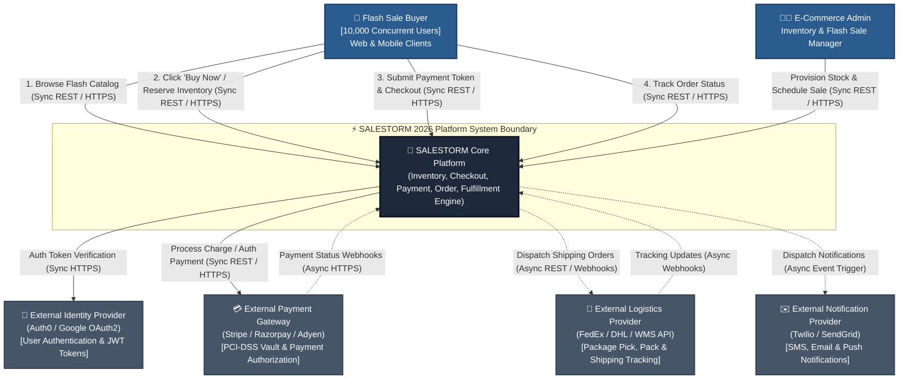

# 02.1 High-Level Design — System Context Diagram (C4 Level 1)

## Overview
The System Context Diagram defines the high-level boundary of the **SALESTORM 2026** platform, identifying human actors, external enterprise dependencies, and primary communication protocols (Synchronous REST/gRPC vs Asynchronous Event/Webhook queues).

---

## C4 System Context Diagram

---

## Interface Protocol & Interaction Breakdown

| Source | Target | Interaction Type | Data Payload / Protocol | Purpose & SLA Target |
| :--- | :--- | :--- | :--- | :--- |
| **Buyer** | **SALESTORM** | Synchronous | HTTPS / JSON / REST | Flash catalog view ($< 50\text{ms}$), Reservation ($< 200\text{ms}$), Checkout. |
| **SALESTORM** | **IdP (Auth0)** | Synchronous | HTTPS / OAuth2 JWT | Validate Bearer access tokens on incoming requests ($< 15\text{ms}$). |
| **SALESTORM** | **Payment Gateway** | Synchronous | HTTPS / REST | Credit Card Authorization & Capture with Idempotency Header ($< 800\text{ms}$). |
| **Payment Gateway**| **SALESTORM** | Asynchronous | HTTPS Webhook | Out-of-band payment confirmation or async failure settlement. |
| **SALESTORM** | **Logistics** | Asynchronous | Webhook / REST | Fulfillment creation after payment confirmation ($< 2\text{s}$ queue latency). |
| **SALESTORM** | **Notification** | Asynchronous | AMQP / REST API | Dispatch purchase confirmation SMS/Email off the critical purchase path. |

---

## High-Level System Boundaries & Key Bottlenecks

### 1. Ingress Surge Bottleneck
- **Challenge**: 10,000 customers hitting the exact same endpoint in $t = 0$.
- **Architectural Boundary Mitigation**: Cloudflare Edge WAF + Kong API Gateway enforces Token Bucket Rate Limiting and Virtual Waiting Room queuing before traffic reaches application containers.

### 2. Third-Party Payment Gateway Dependency
- **Challenge**: Third-party payment gateways can experience latency degradation or HTTP 504 timeouts.
- **Architectural Boundary Mitigation**: Payment Service uses Circuit Breaker (Resilience4j) with fallback to asynchronous webhooks and outbox reconciliation.

---
*Document Version: 1.0.0 — SALESTORM 2026 Context Design*
