# 03.1 Low-Level Design — Class Diagrams

## Overview
The Class Diagrams define the object-oriented structure, domain models, entity relationships, design patterns, and repository interfaces governing the **Flash Inventory**, **Payment**, and **Order** microservices.

---

## Unified Domain Class Diagram

```mermaid
classDiagram
    %% Core Domain Enumerations
    class ReservationStatus {
        <<enumeration>>
        PENDING
        CONFIRMED
        EXPIRED
        RELEASED
        FAILED
    }

    class OrderStatus {
        <<enumeration>>
        CREATED
        PAYMENT_PENDING
        PAID
        PROCESSING
        SHIPPED
        DELIVERED
        CANCELLED
        REFUNDED
    }

    class PaymentStatus {
        <<enumeration>>
        INITIATED
        PROCESSING
        AUTHORIZED
        CAPTURED
        FAILED
        REFUNDED
    }

    %% Inventory Domain Classes
    class InventoryItem {
        +String productId
        +int availableQuantity
        +int reservedQuantity
        +int totalSoldQuantity
        +long version
        +atomicDecrement(int qty) bool
        +releaseQuantity(int qty) void
    }

    class InventoryReservation {
        +UUID reservationId
        +String productId
        +String userId
        +String token
        +ReservationStatus status
        +DateTime createdAt
        +DateTime expiresAt
        +bool isValid()
        +confirm() void
        +expire() void
    }

    class LuaReservationEngine {
        -RedisTemplate redis
        +ReservationResult executeReservation(String productId, String userId, int ttlSeconds)
        +void releaseStock(String productId, String reservationId)
    }

    %% Payment Domain Classes
    class Payment {
        +UUID paymentId
        +UUID orderId
        +String userId
        +Money amount
        +String currency
        +String idempotencyKey
        +String gatewayTransactionId
        +PaymentStatus status
        +DateTime createdAt
        +authorize() void
        +fail(String reason) void
    }

    class PaymentIdempotencyRecord {
        +String idempotencyKey
        +String userId
        +UUID paymentId
        +String responsePayload
        +DateTime createdAt
    }

    class IPaymentGatewayAdapter {
        <<interface>>
        +PaymentResponse processCharge(PaymentRequest request)
        +PaymentStatus queryStatus(String gatewayTxnId)
        +bool refund(String gatewayTxnId, Money amount)
    }

    class StripeGatewayAdapter {
        -StripeClient client
        +PaymentResponse processCharge(PaymentRequest request)
        +PaymentStatus queryStatus(String gatewayTxnId)
        +bool refund(String gatewayTxnId, Money amount)
    }

    class RazorpayGatewayAdapter {
        -RazorpayClient client
        +PaymentResponse processCharge(PaymentRequest request)
        +PaymentStatus queryStatus(String gatewayTxnId)
        +bool refund(String gatewayTxnId, Money amount)
    }

    %% Order & Saga Domain Classes
    class Order {
        +UUID orderId
        +String userId
        +UUID reservationId
        +List~OrderLineItem~ lineItems
        +Money totalAmount
        +OrderStatus status
        +long version
        +DateTime createdAt
        +markPaid() void
        +cancel(String reason) void
    }

    class OrderLineItem {
        +String productId
        +int quantity
        +Money unitPrice
    }

    class OrderSagaCoordinator {
        -OrderRepository orderRepo
        -KafkaProducer eventBus
        +void handlePaymentAuthorized(PaymentAuthorizedEvent event)
        +void handlePaymentFailed(PaymentFailedEvent event)
        +void executeCompensation(UUID sagaId)
    }

    %% Relationships
    InventoryItem "1" -- "*" InventoryReservation : tracks
    InventoryReservation --> ReservationStatus : status
    LuaReservationEngine ..> InventoryReservation : generates

    Order "1" *-- "1..*" OrderLineItem : contains
    Order --> OrderStatus : status
    OrderSagaCoordinator --> Order : manages state

    Payment --> PaymentStatus : status
    Payment "1" -- "1" PaymentIdempotencyRecord : verified by
    IPaymentGatewayAdapter <|.. StripeGatewayAdapter : implements
    IPaymentGatewayAdapter <|.. RazorpayGatewayAdapter : implements
    Payment --> IPaymentGatewayAdapter : uses
```



---

## Detailed Class Attributes & Methods

### 1. `LuaReservationEngine` (Flash Inventory Core)
```java
public class LuaReservationEngine {
    private final StringRedisTemplate redisTemplate;
    private final DefaultRedisScript<List> reservationScript;

    public ReservationResult executeReservation(String productId, String userId, int ttlSeconds) {
        List<String> keys = List.of("stock:" + productId, "reservation:" + productId + ":" + userId);
        List<Object> result = redisTemplate.execute(reservationScript, keys, userId, String.valueOf(ttlSeconds));
        
        long resultCode = (Long) result.get(0);
        if (resultCode == 1L) {
            String token = (String) result.get(1);
            long remaining = (Long) result.get(2);
            return ReservationResult.success(token, remaining);
        } else if (resultCode == -1L) {
            return ReservationResult.failed("SOLD_OUT");
        } else {
            return ReservationResult.failed("ALREADY_RESERVED");
        }
    }
}
```

### 2. `IPaymentGatewayAdapter` Interface (Strategy & Adapter Patterns)
- Decouples core payment execution logic from third-party vendor SDKs.
- Supports runtime selection of Stripe, Razorpay, or Adyen based on regional configuration.

### 3. `OrderSagaCoordinator` Class (Saga Orchestration Pattern)
- Coordinates distributed checkout transactions. Maintains the state machine and dispatches compensation events when sub-transactions (such as Payment Authorization) fail.

---
*Document Version: 1.0.0 — SALESTORM 2026 Class Design*
