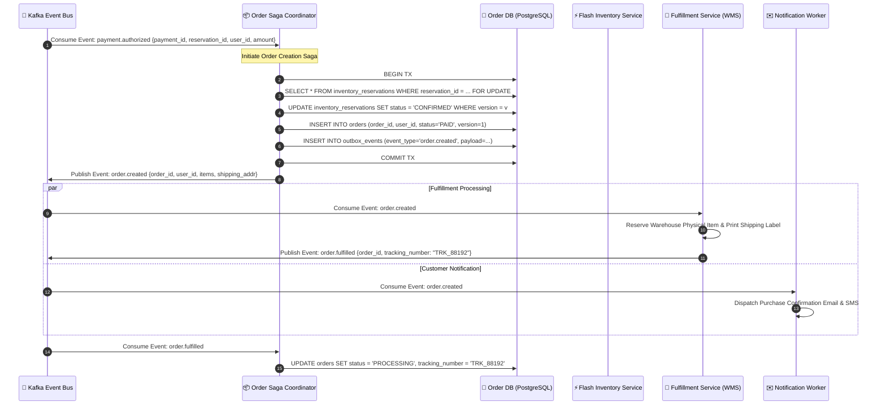
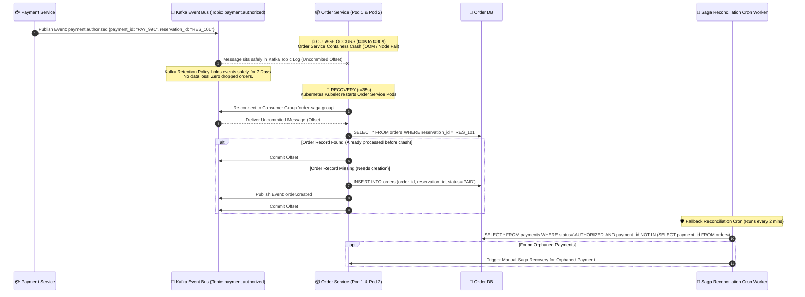

# 03.4 Low-Level Design — Sequence Diagram: Order Lifecycle & Crash Recovery

## Overview
This sequence diagram illustrates the **Order Lifecycle & Saga Orchestration** workflow. It details how confirmed payment events are consumed, how orders are persisted using Optimistic Concurrency Control (OCC), how fulfillment is triggered, and how the system recovers seamlessly during a **30-second Order Service crash**.

---

## 1. Happy Path Order Creation & Saga Orchestration

---

## 2. Order Service 30-Second Outage & Self-Healing Recovery Sequence

This scenario demonstrates system resilience when the **Order Service container crashes for 30 seconds** right after the Payment Service publishes `payment.authorized`.

---

## 3. Resilience Guarantees & Disaster Recovery Metrics

1. **Zero Message Loss**: Kafka persistent append-only logs store uncommitted offsets. Even during container crashes, events remain durable on disk across replicas (`min.insync.replicas = 2`).
2. **At-Least-Once Delivery + At-Most-Once Execution**: Order consumers verify database state (`reservation_id` uniqueness) before applying state transitions, ensuring idempotency upon crash recovery.
3. **Recovery Time Objective (RTO)**: $< 45\text{ seconds}$ (Kubernetes pod restart + Kafka consumer group rebalance time).
4. **Recovery Point Objective (RPO)**: $0\text{ seconds}$ (No state lost due to WAL persistence and transactional outbox).

---
*Document Version: 1.0.0 — SALESTORM 2026 Order Sequence Design*
