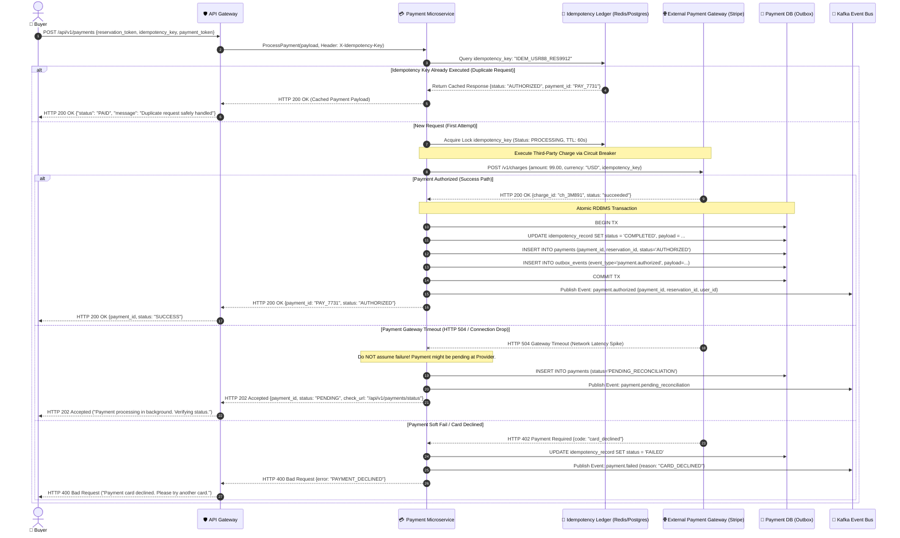
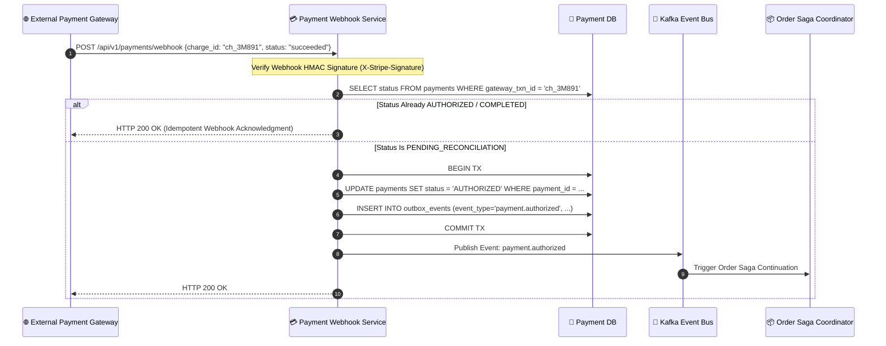

# 03.3 Low-Level Design — Sequence Diagram: Payment Processing & Idempotency

## Overview
This sequence diagram details the **Payment Service** execution pipeline. It models strict idempotency handling, third-party payment gateway integration (Stripe/Razorpay), HTTP 504 timeout recovery, duplicate submission protection, and the Transactional Outbox event publishing mechanism.

---

## 1. Idempotent Payment Authorization Sequence Diagram

---

## 2. Webhook & Asynchronous Payment Reconciliation Sequence

When a payment gateway timed out (HTTP 504), the Payment Service relies on Webhook callbacks or a background polling cron worker to resolve the transaction state definitively.

---

## 3. Payment Failure Recovery & Circuit Breaker Logic

- **Circuit Breaker Thresholds**: Configured with Resilience4j ($50\%$ failure rate over a rolling 20-request window triggers `OPEN` state).
- **Fallback Action**: When the Payment Gateway circuit opens, the system rejects new payment authorizations gracefully with `HTTP 503 Service Unavailable`, preventing cascade failures and allowing the gateway to recover.

---
*Document Version: 1.0.0 — SALESTORM 2026 Payment Sequence Design*
