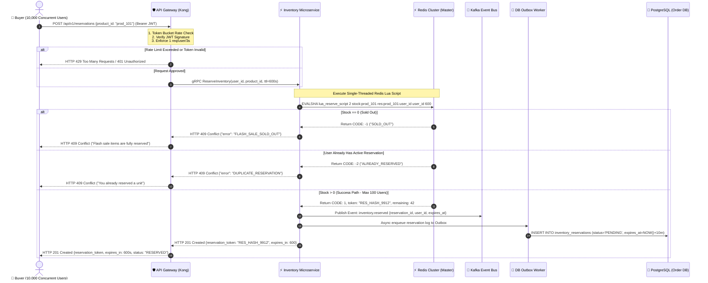
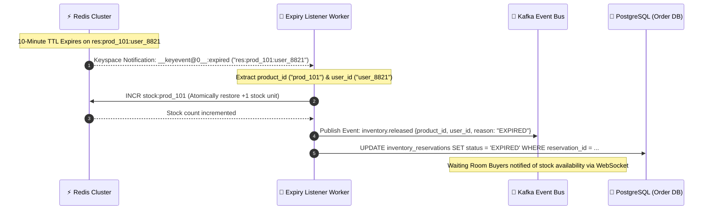

# 03.2 Low-Level Design — Sequence Diagram: Purchase & Reservation

## Overview
This sequence diagram details the extreme-concurrency **Inventory Reservation** path when 10,000 customers hit the "Buy Now" endpoint simultaneously. It details the interaction between the API Gateway, Flash Inventory Microservice, Redis Cluster (executing an atomic Lua script), and the automated 10-minute expiry cleanup workflow.

---

## 1. Purchase & Inventory Reservation Sequence Diagram



---

## 2. Production Redis Lua Script (Atomic Reservation Engine)

To guarantee **Zero Oversell** under 10,000 concurrent threads without database row locks, the system executes the following atomic Lua script inside Redis:

```lua
-- KEYS[1]: stock:product_id (String counter e.g., "100")
-- KEYS[2]: reservation:product_id:user_id (String token key with TTL)
-- ARGV[1]: user_id
-- ARGV[2]: ttl_seconds (e.g., 600)

local stock_key = KEYS[1]
local user_res_key = KEYS[2]
local user_id = ARGV[1]
local ttl = tonumber(ARGV[2])

-- Check if user already holds an active reservation
if redis.call("EXISTS", user_res_key) == 1 then
    return {-2, "ALREADY_RESERVED", 0}
end

-- Get current stock count
local current_stock = tonumber(redis.call("GET", stock_key) or "0")

if current_stock <= 0 then
    return {-1, "SOLD_OUT", 0}
end

-- Atomically decrement stock
local remaining_stock = redis.call("DECR", stock_key)

-- Generate secure reservation token hash
local token = "RES_" .. redis.call("TIME")[1] .. "_" .. math.random(100000, 999999)

-- Set reservation key with 10-minute TTL (600 seconds)
redis.call("SET", user_res_key, token, "EX", ttl)

-- Return Success Code 1, Reservation Token, and Remaining Stock
return {1, token, remaining_stock}
```

---

## 3. Reservation Expiry & Automatic Stock Release Sequence

If a customer reserves a unit but fails to complete payment within 10 minutes (600 seconds), the reservation automatically expires and releases the unit back into the available pool for other buyers.



---
*Document Version: 1.0.0 — SALESTORM 2026 Reservation Sequence Design*
