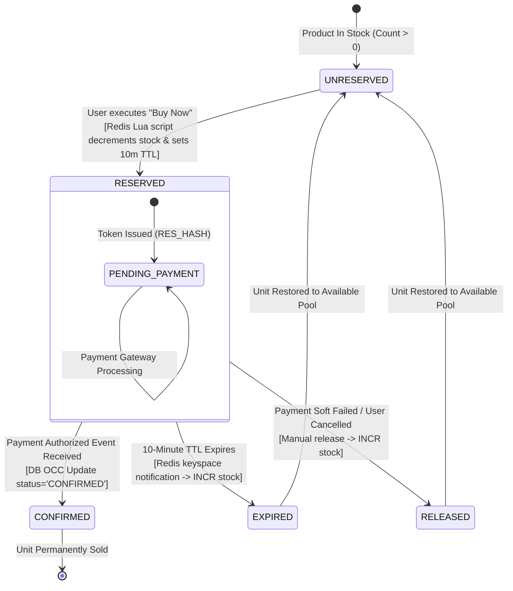
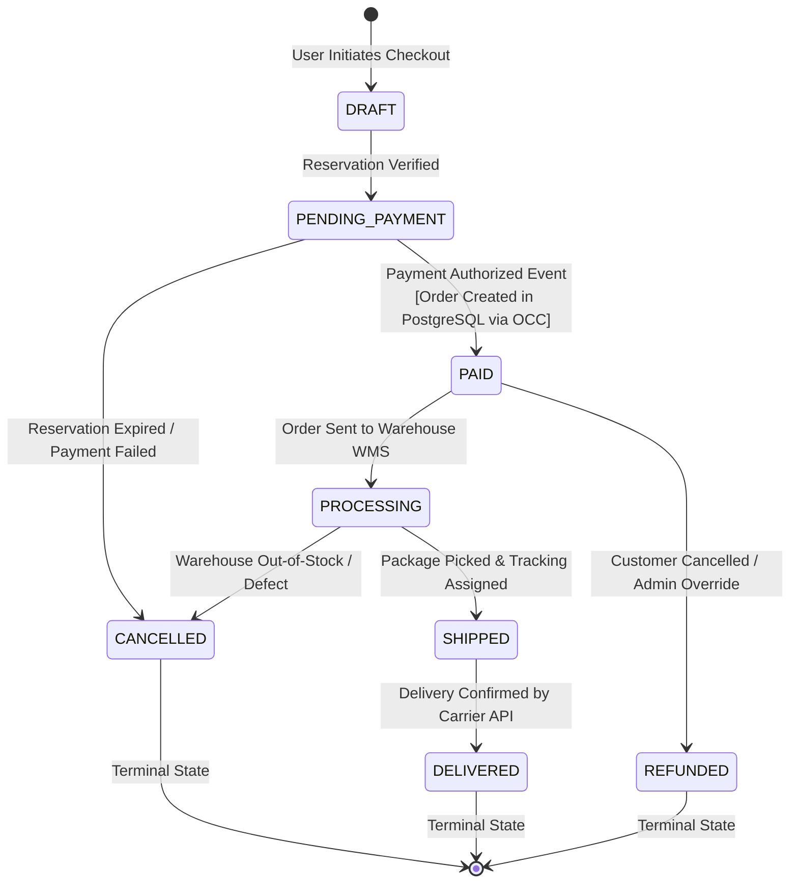
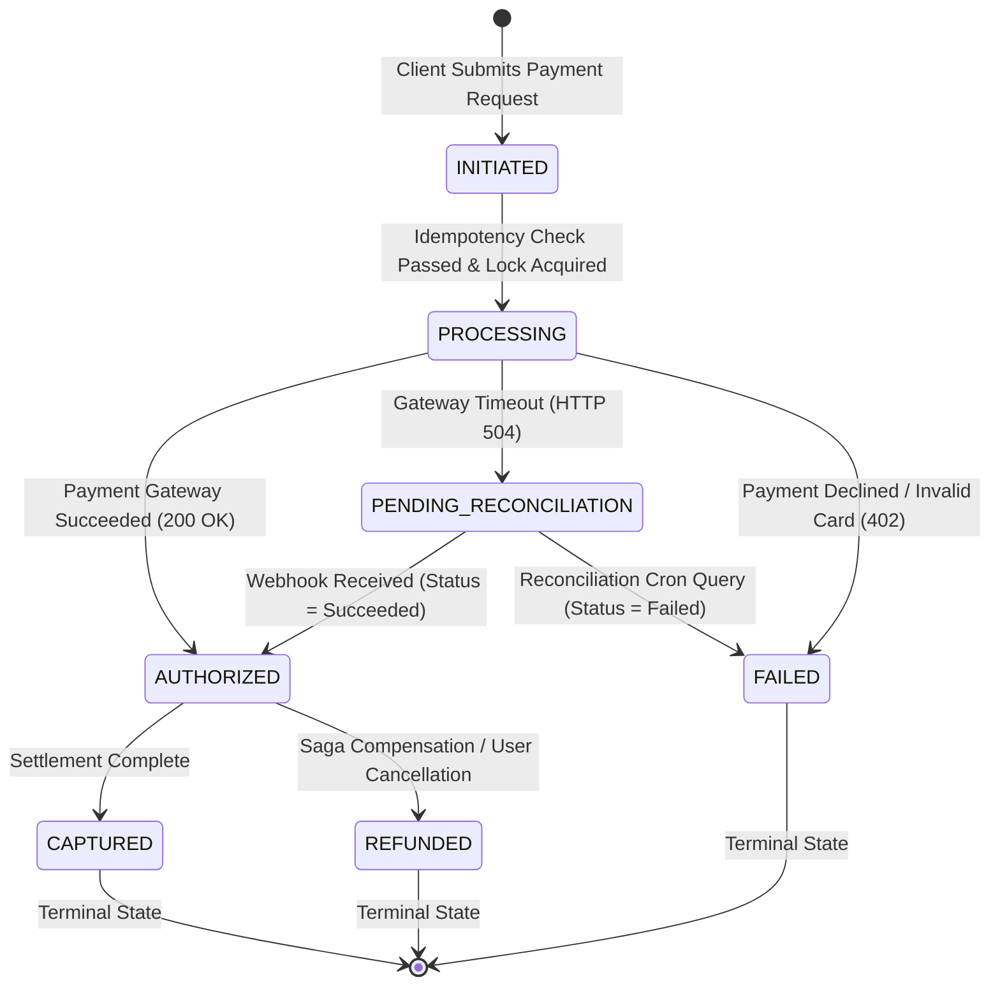

# 03.5 Low-Level Design — State Diagrams

## Overview
This document defines the formal finite state machines (FSM) governing the **Inventory Reservation**, **Order Lifecycle**, and **Payment Transaction** domains. State transitions enforce immutability, state validation rules, and explicit rollback triggers under failure.

---

## 1. Inventory Reservation State Machine

### Transition Rules — Inventory Reservation
- **`UNRESERVED` $\rightarrow$ `RESERVED`**: Atomic execution in Redis Lua script. Emits `reservation_token` with 600s TTL.
- **`RESERVED` $\rightarrow$ `CONFIRMED`**: Terminal success transition upon `payment.authorized` event. Stock counter remains decremented; DB record set to `CONFIRMED`.
- **`RESERVED` $\rightarrow$ `EXPIRED`**: Triggered asynchronously via Redis key expiry listener when $t > 600\text{s}$. Atomically increments Redis stock (`INCR`).
- **`RESERVED` $\rightarrow$ `RELEASED`**: Triggered via explicit compensation when payment card is declined.

---

## 2. Order Lifecycle State Machine

### Transition Rules — Order Lifecycle
- **Invalid State Transition Guard**: An order in `SHIPPED` or `DELIVERED` state can never transition back to `PENDING_PAYMENT` or `CANCELLED`.
- **Compensation Guard**: Transition to `REFUNDED` automatically triggers an asynchronous payment reversal event to the Payment Gateway and dispatches a notification.

---

## 3. Payment Transaction State Machine

---
*Document Version: 1.0.0 — SALESTORM 2026 State Diagram Specifications*
