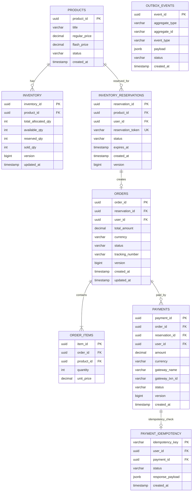

# 04 Database ER Design & Schema Specification

## Overview
This document presents the complete Relational Entity-Relationship (ER) design, indexing strategy, concurrency lock specifications, and SQL DDL schemas for the **SALESTORM 2026** platform. Built on PostgreSQL 16 Multi-AZ Aurora, the database enforces strict ACID compliance, zero oversell via Optimistic Concurrency Control (OCC), and transactional inbox/outbox tables.

---

## 1. Complete Entity-Relationship Diagram



---

## 2. Complete SQL DDL Schema Definitions

```sql
-- Enable UUID extension
CREATE EXTENSION IF NOT EXISTS "uuid-ossp";

-- 1. PRODUCTS TABLE
CREATE TABLE products (
    product_id UUID PRIMARY KEY DEFAULT uuid_generate_v4(),
    title VARCHAR(255) NOT NULL,
    description TEXT,
    regular_price DECIMAL(10, 2) NOT NULL,
    flash_price DECIMAL(10, 2) NOT NULL,
    status VARCHAR(32) NOT NULL DEFAULT 'ACTIVE',
    created_at TIMESTAMP WITH TIME ZONE DEFAULT CURRENT_TIMESTAMP
);

-- 2. INVENTORY TABLE (Optimistic Concurrency Control)
CREATE TABLE inventory (
    inventory_id UUID PRIMARY KEY DEFAULT uuid_generate_v4(),
    product_id UUID NOT NULL UNIQUE REFERENCES products(product_id),
    total_allocated_qty INT NOT NULL CHECK (total_allocated_qty >= 0),
    available_qty INT NOT NULL CHECK (available_qty >= 0),
    reserved_qty INT NOT NULL DEFAULT 0 CHECK (reserved_qty >= 0),
    sold_qty INT NOT NULL DEFAULT 0 CHECK (sold_qty >= 0),
    version BIGINT NOT NULL DEFAULT 1,
    updated_at TIMESTAMP WITH TIME ZONE DEFAULT CURRENT_TIMESTAMP,
    CONSTRAINT chk_qty_balance CHECK (total_allocated_qty = available_qty + reserved_qty + sold_qty)
);

-- 3. INVENTORY RESERVATIONS TABLE
CREATE TABLE inventory_reservations (
    reservation_id UUID PRIMARY KEY DEFAULT uuid_generate_v4(),
    product_id UUID NOT NULL REFERENCES products(product_id),
    user_id UUID NOT NULL,
    reservation_token VARCHAR(128) NOT NULL UNIQUE,
    status VARCHAR(32) NOT NULL DEFAULT 'PENDING', -- PENDING, CONFIRMED, EXPIRED, RELEASED
    expires_at TIMESTAMP WITH TIME ZONE NOT NULL,
    created_at TIMESTAMP WITH TIME ZONE DEFAULT CURRENT_TIMESTAMP,
    version BIGINT NOT NULL DEFAULT 1
);

-- 4. ORDERS TABLE (Partitioned by Range on created_at)
CREATE TABLE orders (
    order_id UUID DEFAULT uuid_generate_v4(),
    reservation_id UUID NOT NULL REFERENCES inventory_reservations(reservation_id),
    user_id UUID NOT NULL,
    total_amount DECIMAL(10, 2) NOT NULL,
    currency VARCHAR(3) NOT NULL DEFAULT 'USD',
    status VARCHAR(32) NOT NULL DEFAULT 'PAID', -- PAID, PROCESSING, SHIPPED, DELIVERED, CANCELLED
    tracking_number VARCHAR(64),
    version BIGINT NOT NULL DEFAULT 1,
    created_at TIMESTAMP WITH TIME ZONE NOT NULL DEFAULT CURRENT_TIMESTAMP,
    updated_at TIMESTAMP WITH TIME ZONE DEFAULT CURRENT_TIMESTAMP,
    PRIMARY KEY (order_id, created_at)
) PARTITION BY RANGE (created_at);

-- Example Monthly Partitions
CREATE TABLE orders_2026_10 PARTITION OF orders
    FOR VALUES FROM ('2026-10-01 00:00:00+00') TO ('2026-11-01 00:00:00+00');

-- 5. ORDER ITEMS TABLE
CREATE TABLE order_items (
    item_id UUID PRIMARY KEY DEFAULT uuid_generate_v4(),
    order_id UUID NOT NULL,
    created_at TIMESTAMP WITH TIME ZONE NOT NULL,
    product_id UUID NOT NULL REFERENCES products(product_id),
    quantity INT NOT NULL CHECK (quantity > 0),
    unit_price DECIMAL(10, 2) NOT NULL
);

-- 6. PAYMENTS TABLE
CREATE TABLE payments (
    payment_id UUID PRIMARY KEY DEFAULT uuid_generate_v4(),
    order_id UUID,
    reservation_id UUID NOT NULL REFERENCES inventory_reservations(reservation_id),
    user_id UUID NOT NULL,
    amount DECIMAL(10, 2) NOT NULL,
    currency VARCHAR(3) NOT NULL DEFAULT 'USD',
    gateway_name VARCHAR(32) NOT NULL, -- STRIPE, RAZORPAY
    gateway_txn_id VARCHAR(128),
    status VARCHAR(32) NOT NULL DEFAULT 'INITIATED', -- INITIATED, AUTHORIZED, FAILED, REFUNDED
    version BIGINT NOT NULL DEFAULT 1,
    created_at TIMESTAMP WITH TIME ZONE DEFAULT CURRENT_TIMESTAMP
);

-- 7. PAYMENT IDEMPOTENCY LEDGER
CREATE TABLE payment_idempotency (
    idempotency_key VARCHAR(128) PRIMARY KEY,
    user_id UUID NOT NULL,
    payment_id UUID REFERENCES payments(payment_id),
    status VARCHAR(32) NOT NULL DEFAULT 'PROCESSING', -- PROCESSING, COMPLETED, FAILED
    response_payload JSONB,
    created_at TIMESTAMP WITH TIME ZONE DEFAULT CURRENT_TIMESTAMP
);

-- 8. TRANSACTIONAL OUTBOX TABLE
CREATE TABLE outbox_events (
    event_id UUID PRIMARY KEY DEFAULT uuid_generate_v4(),
    aggregate_type VARCHAR(64) NOT NULL,
    aggregate_id VARCHAR(64) NOT NULL,
    event_type VARCHAR(64) NOT NULL,
    payload JSONB NOT NULL,
    status VARCHAR(32) NOT NULL DEFAULT 'PENDING', -- PENDING, PUBLISHED, FAILED
    created_at TIMESTAMP WITH TIME ZONE DEFAULT CURRENT_TIMESTAMP
);
```

---

## 3. High-Performance Indexing Strategy

```sql
-- Partial Index on Active Pending Reservations for Fast Expiry Polling
CREATE INDEX idx_res_pending_expiry 
ON inventory_reservations(expires_at) 
WHERE status = 'PENDING';

-- Unique Partial Index to prevent multiple active pending reservations per user per product
CREATE UNIQUE INDEX idx_unique_active_user_reservation 
ON inventory_reservations(product_id, user_id) 
WHERE status = 'PENDING';

-- B-Tree Index on Gateway Transaction Lookup (For Fast Webhook Processing)
CREATE INDEX idx_payments_gateway_txn 
ON payments(gateway_txn_id);

-- Partial Index for CDC Outbox Relayer
CREATE INDEX idx_outbox_pending 
ON outbox_events(created_at) 
WHERE status = 'PENDING';

-- User Order History Lookup Index
CREATE INDEX idx_orders_user 
ON orders(user_id, created_at DESC);
```

---
*Document Version: 1.0.0 — SALESTORM 2026 ER & Database Specification*
