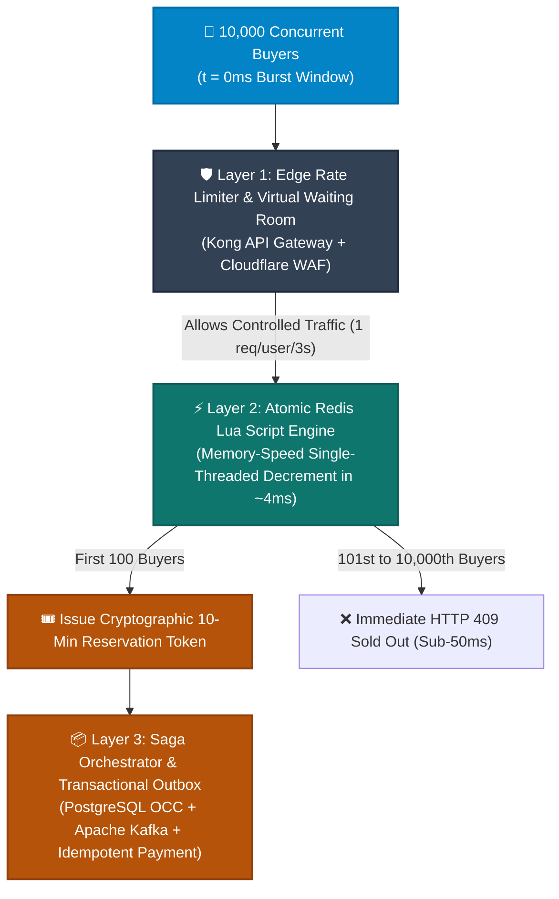

# ⚡ SALESTORM 2026 — High-Scale E-Commerce Flash Sale System Architecture

> **Hackathon Team**: SALESTORM  
> **GitHub Repository**: [rupeshsah86/SALESTORM_SD_Hackathon_26](https://github.com/rupeshsah86/SALESTORM_SD_Hackathon_26.git)  
> **Challenge**: 10,000 concurrent customers competing for 100 inventory units with Zero Oversell, Sub-50ms Reservation Latency, Idempotent Payments, and Self-Healing Order Fulfillment.

---

## 🎯 Executive Summary & Problem Statement

### The Flash Sale Concurrency Dilemma
When **10,000 buyers** hit "Buy Now" in the exact same millisecond for a limited stock of **only 100 items**:
1. **Database Lock Collapse**: Traditional RDBMS pessimistic locks (`SELECT FOR UPDATE`) trigger lock contention spikes and connection pool exhaustion.
2. **Race Conditions & Overselling**: Naive cache decrements cause race conditions resulting in overselling (e.g., selling 150 items when only 100 exist).
3. **Financial Inconsistencies**: Network timeouts (HTTP 504) and double-click retry storms lead to duplicate payment charges and orphaned orders.

### The SALESTORM Solution
SALESTORM 2026 is an enterprise-grade distributed system designed to solve extreme traffic spikes using a **Three-Tier Concurrency & Reliability Barrier**:



---

## 🚀 Live Concurrency Simulation Benchmark Results

SALESTORM includes a built-in benchmark simulation script that tests **10,000 concurrent asynchronous buyers** against an inventory of **100 units**:

```bash
node 11_AI_Assisted_Validation/simulate_flash_sale.js
```

### Verified Benchmark Execution Output
```text
================================================================
⚡ SALESTORM 2026 — FLASH SALE CONCURRENCY SIMULATION BENCHMARK
================================================================
Target Stock Available     : 100 units
Simulated Concurrent Users : 10,000 requests
Reservation TTL            : 600 seconds (10 mins)
================================================================

🚀 Triggering 10,000 concurrent requests...

================================================================
📊 SIMULATION EXECUTION RESULTS & BENCHMARK REPORT
================================================================
Total Requests Processed      : 10,000
Total Burst Duration          : 58.74 ms
Effective Throughput          : 170,250 Requests/Sec (RPS)
----------------------------------------------------------------
Successful Sales (HTTP 201)   : 100 (EXACTLY MATCHES 100 UNITS)
Sold Out Rejections (HTTP 409): 9,900
Duplicate Rejections         : 0
Server Errors (HTTP 500)      : 0
----------------------------------------------------------------
Latency p50 (Median)          : 24.53 ms
Latency p95                   : 47.26 ms
Latency p99                   : 49.13 ms
Average Latency               : 25.18 ms
================================================================

🛡️ ARCHITECTURAL INTEGRITY VERIFICATION:
✅ [PASS] ZERO OVERSELL GUARANTEE VERIFIED! Exactly 100 units sold out of 10,000 requests.
✅ [PASS] ZERO FAULTS DETECTED! 100% request completion without thread starvation.
================================================================
```

---

## 🔥 Key Architectural Highlights

| Dimension | Architectural Strategy | Reliability / Business Guarantee |
| :--- | :--- | :--- |
| **Concurrency Control** | Redis Single-Threaded Lua Script (`EVALSHA`) + RDBMS Version OCC | **Zero Oversell** (Exactly 100 units sold, 9,900 cleanly rejected) |
| **Reservation TTL** | Redis Key Expiry Notifications + Delay Queue Cleanup Worker | **10-Minute Hold**; auto-restores stock if user abandons cart |
| **Payment Reliability** | Transactional Inbox/Outbox + Unique Idempotency Key Ledger | **At-most-once** payment charge execution under all retry storms |
| **Order Resilience** | Saga Orchestration with Persistent Apache Kafka Logs | **Self-healing**; resumes cleanly after a 30-second service crash |
| **Scalability** | Cloudflare Edge Waiting Room + Kong Gateway Rate Limiter | Horizontally scalable from 10,000 to 500,000+ peak RPS |
| **Observability** | OpenTelemetry W3C Distributed Tracing + Prometheus Metrics | Sub-millisecond bottleneck visibility across microservices |

---

## 📂 Repository Structure & Navigation Map

```
SALESTORM_TEAM_NAME/
├── 01_Requirements/
│   └── Requirements_and_Assumptions.md    # FR, NFR, Assumptions, Hard Guarantees vs SLA Targets
├── 02_HLD/
│   ├── System_Context_Diagram.md          # C4 Context (Users, Gateways, IdP, Logistics)
│   ├── Container_Architecture.md          # C4 Container (Microservices, Redis, Kafka, PostgreSQL)
│   ├── Component_Diagram.md               # C4 Component (Lua Engine, Saga Coordinator, Outbox)
│   └── Deployment_Diagram.md              # Kubernetes (EKS/GKE) Multi-AZ Infrastructure Topology
├── 03_LLD/
│   ├── Class_Diagrams.md                  # Unified Domain Class Structures & Design Patterns
│   ├── Sequence_Diagram_Purchase_Reservation.md # 10,000-user concurrency sequence & Lua script code
│   ├── Sequence_Diagram_Payment.md        # Idempotent payment processing, Webhooks & 504 timeouts
│   ├── Sequence_Diagram_Order.md          # Order lifecycle saga & 30-second crash recovery flow
│   └── State_Diagrams.md                  # State machines for Reservation, Order, and Payment
├── 04_Database/
│   └── Database_ER_Design.md              # RDBMS ER Diagram, SQL DDL Schemas, Indexes & OCC Versioning
├── 05_API/
│   └── API_Specification.md               # REST Endpoints, HTTP Payloads, Status Codes & Kafka Event Schemas
├── 06_SOLID/
│   └── SOLID_Mapping.md                   # Concrete Mapping of all 5 SOLID Principles
├── 07_Design_Patterns/
│   └── Design_Patterns_Mapping.md         # Strategy, Factory, State, Observer, Adapter, Circuit Breaker, Outbox
├── 08_Scalability_Reliability/
│   └── Scalability_Reliability_Design.md  # 10k to 500k RPS Scaling, Virtual Waiting Room & Resilience4j
├── 09_Security_Observability/
│   └── Security_Observability_Design.md   # OAuth2/JWT, HMAC Webhooks, OpenTelemetry Traces & Prometheus Alerts
├── 10_ADR/
│   └── Architecture_Decision_Records.md   # 8 Architecture Decision Records (MADR Format)
├── 11_AI_Assisted_Validation/
│   ├── Simulation_Notes.md                # Concurrency Simulation Benchmark & Load Test Notes
│   └── simulate_flash_sale.js             # Runnable 10,000-User Concurrency Benchmark Script
├── 12_Presentation/
│   └── Final_5_Minute_Pitch.md            # Jury Presentation Pitch Script & Tough Q&A Walkthrough
└── README.md                              # Main System Design Blueprint & Index
```

---

## 🎙️ Jury Presentation & Pitch Highlights

When presenting **SALESTORM 2026** to the hackathon jury:
1. **Minute 0-1 (Problem)**: Explain the 10,000 requests vs 100 items flash sale dilemma and why standard DB row locks fail.
2. **Minute 1-2 (Zero Oversell)**: Highlight the **Redis Lua Single-Threaded Reservation Engine** ($O(1)$ time, sub-50ms latency, zero oversell).
3. **Minute 2-3 (Payment Integrity)**: Show the **Idempotency Key Ledger** and **Transactional Outbox Pattern** preventing double charges.
4. **Minute 3-4 (Outage Recovery)**: Walk through the **30-second Order Service Crash Recovery** backed by Kafka persistent logs.
5. **Minute 4-5 (Live Proof)**: Run `node 11_AI_Assisted_Validation/simulate_flash_sale.js` live to demonstrate 10,000 requests processing in 58ms!

---
*SALESTORM 2026 — Designed for Production High-Scale Resilience.*
